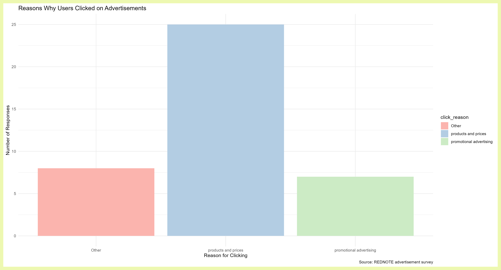
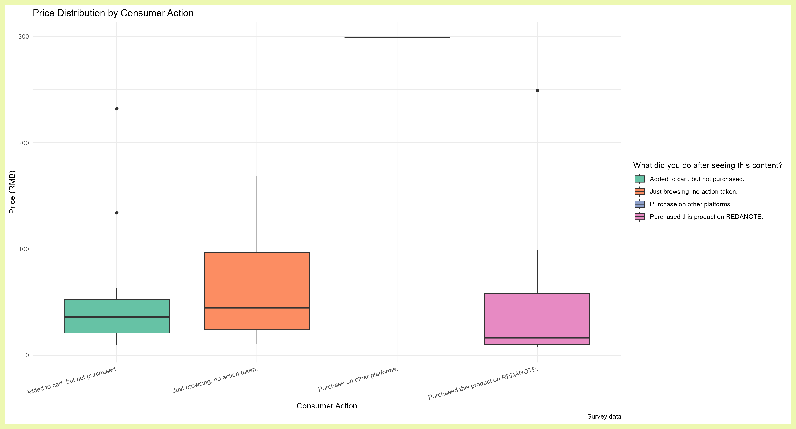
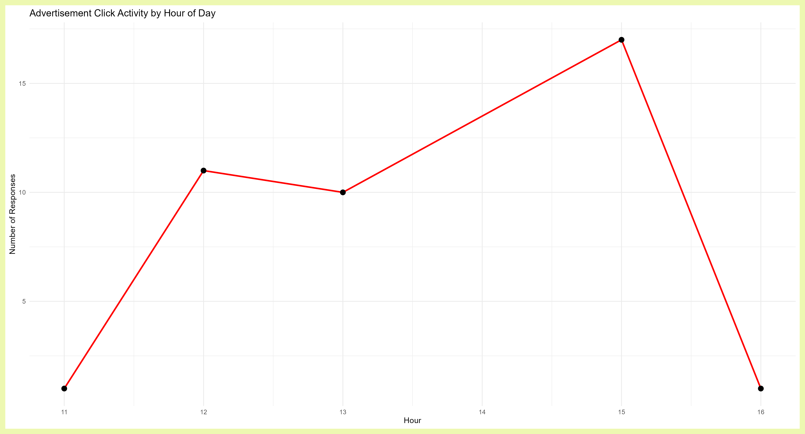

<script src="https://code.jquery.com/jquery-3.7.1.min.js" integrity="sha256-/JqT3SQfawRcv/BIHPThkBvs0OEvtFFmqPF/lYI/Cxo=" crossorigin="anonymous"></script>

```{r setup, include=FALSE}
knitr::opts_chunk$set(echo=FALSE, message=FALSE, warning=FALSE, error=FALSE)
```

```{js}
$(function() {
  $(".level2").css('visibility', 'hidden');
  $(".level2").first().css('visibility', 'visible');
  $(".container-fluid").height($(".container-fluid").height() + 300);
  $(window).on('scroll', function() {
    $('h2').each(function() {
      var h2Top = $(this).offset().top - $(window).scrollTop();
      var windowHeight = $(window).height();
      if (h2Top >= 0 && h2Top <= windowHeight / 2) {
        $(this).parent('div').css('visibility', 'visible');
      } else if (h2Top > windowHeight / 2) {
        $(this).parent('div').css('visibility', 'hidden');
      }
    });
  });
})
```

```{css}
.figcaption {display: none}
```

## What's going on with this data?


## Wait, another dancing cat?


## A dance team of kittens!


```{css, echo=FALSE}
body {
  background-color: #efedf5;
}

h2 {
  color: #756bb1;
}

p {
  font-size: 20px;
}
```


##Reasons why users clicked advertisements

This chart uses **geom_bar()** to show the frequency of different response types to the question “Why did this ad make you click on it?” in the survey.
  I categorized all responses into three broad groups. The first group consists of clicks driven by the ad’s promotional elements, such as the headline or eye-catching images. The second group consists of clicks driven by the product or price. Responses that did not fit into either of these two categories were classified as “Other.”




##price_distribution

This chart uses **geom_boxplot()** to compare the distribution of product prices across different user behaviors.
We analyzed what actions users took after seeing an ad (browsing, adding to cart, purchasing, etc.), how these actions relate to price, and whether price influences user behavior. By comparing the price distributions across different groups, we can see if there is a significant difference in product prices between users who made a purchase and those who did not.




##click_activity_by_hour

This chart uses **geom_bar()** or a line chart to show the number of times users clicked on ads at different times (hours). The time data comes from the Timestamp column, with only the hour portion extracted. This illustrates that user ad-clicking behavior is concentrated during specific time periods, revealing when users are most likely to click on ads.




